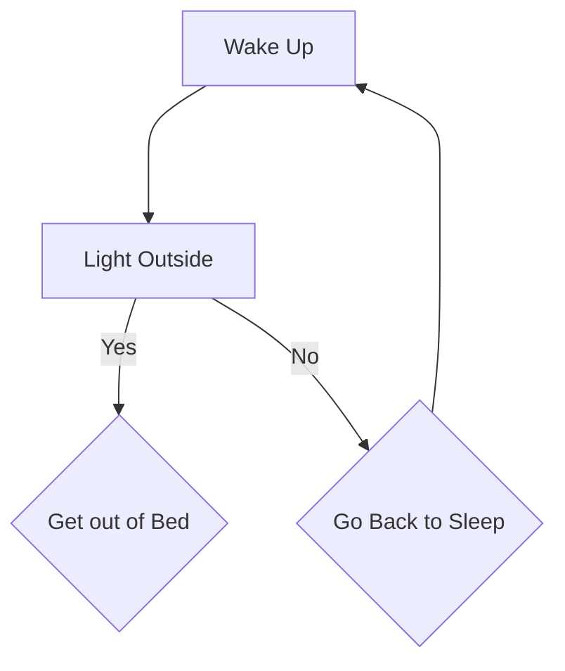

Hi, I'm
`Joseph Lewis`

*Amateur Coder, Professional Eater*

> “Learning to write programs stretches your mind, and helps you think better, creates a way of thinking about things that I think is helpful in all domains.” -Bill Gates

- :electron: Electrical Engineer
- 🎨 Graphic Designer
- 💻 Programmer
- 🍕 Loves Food

[link](https://github.com/PLEXUS21/PLEXUS21/edit/main/README.md)

<!---
PLEXUS21/PLEXUS21 is a ✨ special ✨ repository because its `README.md` (this file) appears on your GitHub profile.
You can click the Preview link to take a look at your changes.
--->
